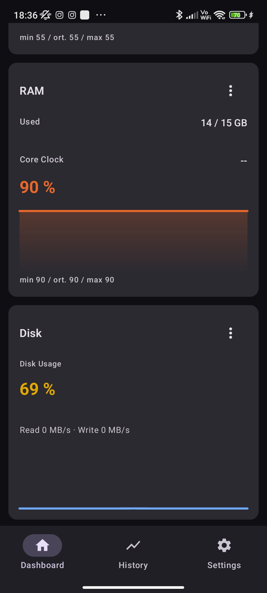
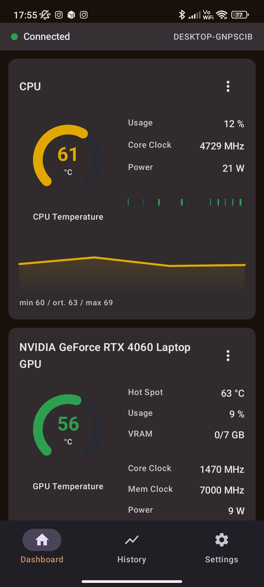
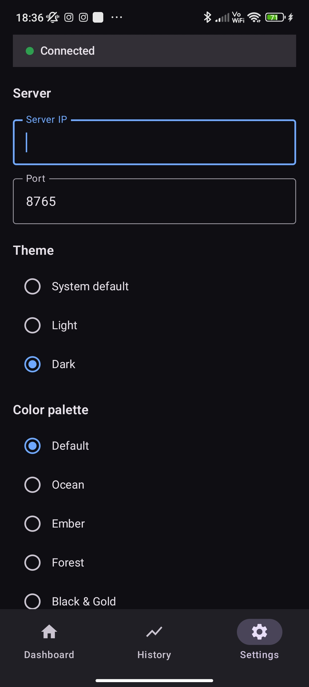
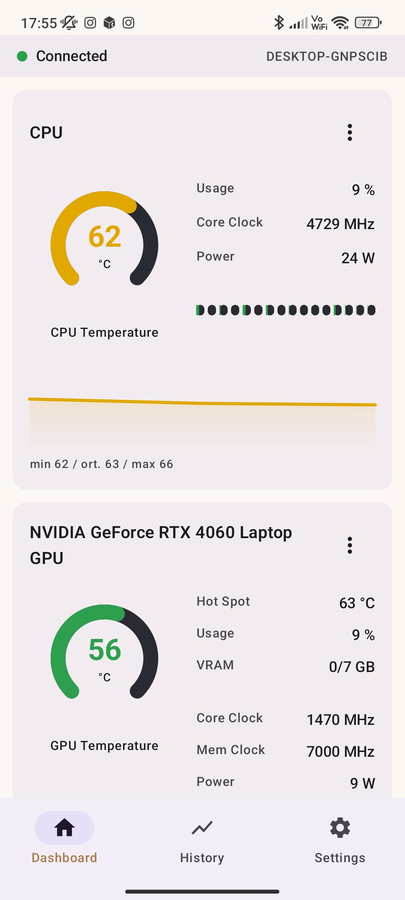
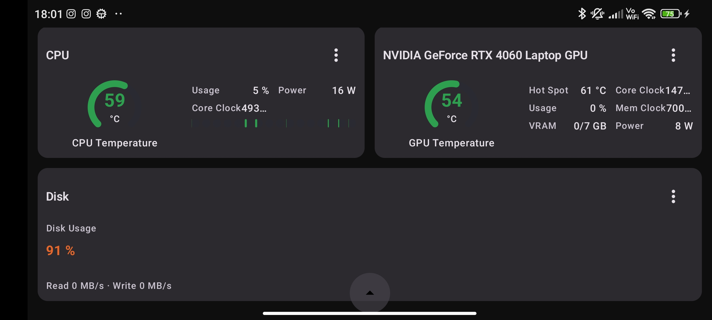
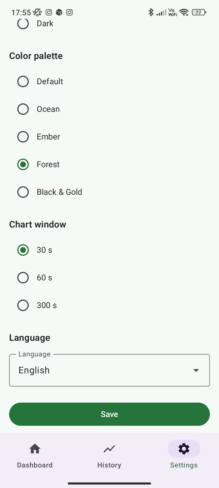

<div align="center">

# PC HW Monitor

**Your PC, on your phone.** Real-time CPU, GPU, RAM, disk, network, fan and FPS stats streamed to your Android device over local Wi-Fi.

<a href="https://github.com/Xeakaes/PcHWmonitor/actions/workflows/codeql.yml" target="_blank">
  
</a>
<a href="https://alternativeto.net/software/pc-hw-monitor/about/" target="_blank">
  
</a>
<a href="https://xeakaes.github.io/PcHWmonitor/" target="_blank">
  
</a>
<a href="https://androidweekly.net/issues/issue-739" target="_blank">
  
</a>

<p>
  
  
  
</p>

<p>
  <a href="https://github.com/Xeakaes/PcHWmonitor/releases"><strong>Download</strong></a> ·
  <a href="#english">English</a> ·
  <a href="#turkce">Türkçe</a>
</p>

</div>

---

<sup><strong>License:</strong> [AGPL-3.0](LICENSE) — the Windows EXE bundles
[LibreHardwareMonitor](https://github.com/LibreHardwareMonitor/LibreHardwareMonitor)
(`LibreHardwareMonitorLib.dll`), also AGPL-3.0.
<strong>Support:</strong> [Patreon](https://www.patreon.com/cw/Obscrum)</sup>

<a id="english"></a>
## English

### 1. Features

- **Android** (Kotlin, Jetpack Compose, Material 3):
   - CPU / GPU / iGPU / RAM cards — temperatures, usage, clock speeds, power, VRAM/RAM, core loads
   - Disk, Network, Fan, and FPS cards — disk usage & throughput, net up/down, fan RPM, game FPS with 1% low
   - Live charts, configurable chart window (30s / 60s / 300s), 1-hour history (Room DB), custom logo
   - **9 color palettes** (Default, Ocean, Ember, Forest, Black & Gold, Material You, Midnight, Sunset, Arctic) — light/dark variants, applies instantly from Settings
   - **Dashboard edit mode**: reorder cards, hide/unhide cards, pin cards to the first screen, and toggle each card between half/full width
   - **Landscape mode: compact scroll-free grid on one screen**, with the nav bar auto-hiding and reappearing on tap; tablets get a wider multi-column layout
   - **Custom Background**: set any image as app background; Material You palette auto-extracted via Palette API for full theme override
   - **Glassmorphism cards**: semi-transparent card surfaces with blurred background image behind (toggleable)
   - **Multi-PC support**: connect to multiple PCs simultaneously, switch between them via tabs on the dashboard
   - **TLS/SSL**: optional encrypted WebSocket connections (`wss://`) with self-signed cert trust dialog
   - **Notification**: persistent notification shows active server's hardware stats; title reflects the active PC name
   - 14 languages (selectable in Settings)
- **Flexible connection setup**: enter the IP + port + access token manually, tap **Scan network** to find the server automatically, or tap **Fill via QR** — the server tray displays a QR code that fills everything on the phone with a single scan
- **Windows EXE** (single file): zero-install hardware reading via an embedded `LibreHardwareMonitorLib.dll`; FastAPI + WebSocket streams data to your phone. No PC hardware? `--simulate` mode generates realistic fake data. Disk/Network stats come from `psutil`; packaged FPS support uses an embedded `PresentMon64.exe` (see Building the EXE).
- **Server SSL/TLS**: optional `--ssl-cert`/`--ssl-key` flags for encrypted connections; `--ssl-cert auto` generates a self-signed certificate automatically

### 2. Screenshots

| | |
|---|---|
|  |  |
|  |  |

### 3. Download

- **Android:** [GitHub Releases](https://github.com/Xeakaes/PcHWmonitor/releases) — latest APK. Also on [F-Droid](https://f-droid.org/) (MR !44635, CI passing).
- **Windows:** `PcHwMonitor.exe` — single-file server, built with `build_exe.bat` (see Getting Started).

### 4. Architecture

```
Windows PC(s)
  PcHwMonitor.exe (port 8765)
    ├─ default: embedded LibreHardwareMonitorLib (in-process reading, --uac-admin manifest)
    ├─ or: LibreHardwareMonitor Remote Web Server (8085) → --source http
    │ WebSocket ws://<pc-ip>:8765/ws  (or wss:// with --ssl-cert)
    │ CPU/GPU/RAM/igpu from LHM; Disk/Network from psutil; FPS from PresentMon64
    │
    ├─ Optional: Cloudflare Tunnel → persistent URL (e.g. https://abc123.trycloudflare.com)
    │   Enables remote access without port forwarding or firewall changes
    │
Android app (same Wi-Fi or internet via Cloudflare Tunnel)
  └─ Multi-PC: connect to multiple servers, switch via dashboard tabs
     TLS: wss:// with self-signed cert trust dialog
```

The Android app only talks to the server; it never touches LibreHardwareMonitor directly.

### 5. Getting Started

#### Windows EXE (recommended)

1. Run `dist\PcHwMonitor.exe`, accept the UAC prompt (admin rights are needed for CPU temperature). The console prints an **access token**, and the tray menu can display it again (Info) or show a **QR code** (Show QR).
2. On your phone, open the **Settings** tab and tap **Fill via QR** to scan the code — IP, port and token fill automatically; or enter them manually (IP e.g. `192.168.1.50`, port `8765`) and press **Connect**.
3. The EXE sits in the system tray (next to the clock); its menu offers **Show QR**, **Copy connection info** and **Info**, and **Exit** shuts the server down. The phone shows "Bağlantı yok" (No connection) when it is offline.

To rebuild, run `build_exe.bat` at the project root on Windows (needs pythonnet + pyinstaller; it copies the DLLs into `server\vendor` and bundles them). In packaged mode, errors are logged to `dist\pchw.log`.

`psutil` (used for Disk and Network sensors) is listed in `server/requirements.txt`. Packaged FPS support additionally requires `server/presentmon/PresentMon64.exe`; `build_exe.bat` copies it into `dist/` when present and disables FPS otherwise.

#### Server Setup (development)

**Windows (real data):**

```bash
cd server
python -m venv .venv
.venv\Scripts\pip install -r requirements.txt -r requirements-dev.txt   # pythonnet via requirements-dev
.venv\Scripts\python main.py
```

Options: `--port <8765>` · `--source <auto|http|lib>` · `--lhm-url <http://127.0.0.1:8085/data.json>` · `--interval <ms>` · `--simulate` · `--fps-process <name>`

- `--source auto` (default): uses the embedded DLL if present (`lib`), falls back to the LHM web server.
- `--source lib`: reads `LibreHardwareMonitorLib.dll` in-process (DLL path can be set via the `LHMDIR` env var).
- `--source http`: reads the JSON API of an external LibreHardwareMonitor (Options → Remote Web Server, port 8085).
- `--fps-process <name>`: targets a specific process for frame capture (e.g. `--fps-process game.exe`). Omit it (or pass empty) and PresentMon auto-follows the active fullscreen process. Requires `server/presentmon/PresentMon64.exe`; if missing, FPS is disabled and `fps` comes back as `null`.

**Simulation mode (for testing, any OS):**

```bash
cd server
python3 -m venv .venv
.venv/bin/pip install -r requirements.txt
.venv/bin/python main.py --simulate --port 8765
```

**Verify the server:**

```bash
curl http://localhost:8765/health          # {"ok":true,"source":"..."}
.venv/bin/python smoke_test.py             # verifies welcome + 3 status messages
.venv/bin/python -m pytest tests -v        # 48 server tests
```

#### Android Setup

```bash
./gradlew :app:assembleDebug
adb install app/build/outputs/apk/debug/app-debug.apk
```

Tests: `./gradlew :app:testDebugUnitTest` (79 unit tests)

### 5b. Remote Access via Cloudflare Tunnel

By default, PC HW Monitor works on your local Wi-Fi network only. If you want to access your PC's stats from outside your home network (e.g. from work, while traveling), you can use a **Cloudflare Tunnel** — a free, secure way to expose your server to the internet without opening ports on your router.

#### Why Cloudflare Tunnel?

- **No port forwarding**: your router's firewall stays closed
- **No static IP needed**: works even if your ISP gives you a dynamic IP
- **Encrypted**: traffic goes through Cloudflare's edge network (HTTPS/WSS)
- **Persistent URL**: unlike Quick Tunnels, a Named Tunnel gives you the same URL every time
- **Free**: Cloudflare's free tier supports unlimited tunnels

#### How it works

1. The server runs `cloudflared` as a sidecar process
2. `cloudflared` connects to Cloudflare's edge network
3. Cloudflare assigns a persistent URL (e.g. `https://abc123.trycloudflare.com`)
4. The Android app connects to this URL instead of the local IP
5. Traffic flows: Android → Cloudflare Edge → your PC

#### Setup (one-time, ~5 minutes)

**Step 1: Install cloudflared**

Download from https://developers.cloudflare.com/cloudflare-one/connections/connect-networks/downloads/ and place `cloudflared.exe` next to `PcHwMonitor.exe`.

**Step 2: Authenticate with Cloudflare**

```bash
cloudflared tunnel login
```

This opens a browser. Log in to your Cloudflare account and authorize.

**Step 3: Create a tunnel**

```bash
cloudflared tunnel create pc-monitor
```

This gives you a tunnel ID (e.g. `a1b2c3d4-...`).

**Step 4: Run the server with tunnel**

```bash
PcHwMonitor.exe --tunnel pc-monitor
```

The server will:
1. Start the WebSocket server on port 8765
2. Start `cloudflared` as a child process
3. Print the tunnel URL in the console

**Step 5: Connect from the app**

In the Android app's Settings:
1. Add a new server
2. Enter the tunnel URL as the IP (e.g. `abc123.trycloudflare.com`)
3. Enter `443` as the port
4. Enable TLS (the tunnel uses HTTPS/WSS)
5. Enter your access token
6. Tap **Connect**

#### Quick Tunnel (no account required)

For a temporary tunnel without any Cloudflare account:

```bash
cloudflared tunnel --url http://localhost:8765
```

This generates a random URL that expires when you stop the process. Good for testing, not for daily use.

#### Troubleshooting

| Problem | Solution |
|---|---|
| Tunnel URL not appearing | Make sure `cloudflared.exe` is in the same folder as `PcHwMonitor.exe` |
| Connection refused | Check that the server is running on port 8765 before starting the tunnel |
| SSL errors | The tunnel uses its own certificate; enable TLS in the app and trust the cert |

### 6. WebSocket Protocol

One `status` message per second from server to client; `welcome` comes first on connect:

```json
{"type":"welcome","intervalMs":1000,"serverName":"DESKTOP-ABC","source":"lhm-lib","pcName":"DESKTOP-ABC"}

 {"type":"status","timestamp":1754150000,
  "cpu":{"name":"...","usagePct":34.5,"tempC":61.2,"clockMhz":5100,"powerW":125,"loads":[12,45,33]},
  "gpu":{"name":"...","usagePct":78.3,"tempC":71.4,"hotspotC":84.1,"vramUsedMb":6112,"vramTotalMb":12288,
         "coreClockMhz":2745,"memClockMhz":10500,"powerW":182},
  "igpu":{"name":"Intel(R) UHD Graphics","usagePct":5.2,"tempC":null,"hotspotC":null,
          "vramUsedMb":null,"vramTotalMb":null,"coreClockMhz":300,"memClockMhz":null,
          "powerW":null},
  "ram":{"usedGb":11.2,"totalGb":32,"usagePct":35,"clockMhz":3600},
  "disk":{"usagePct":40.3,"readMbPerSec":142.7,"writeMbPerSec":18.3},
  "net":{"downloadMbPerSec":8.1,"uploadMbPerSec":1.6},
  "fans":[{"label":"CPU Fan","rpm":2150},{"label":"GPU Fan","rpm":1900}],
  "fps":{"name":"Counter-Strike 2","current":142.3,"avg":138.7,"onePercentLow":97}}

{"type":"status","timestamp":1754150001,
  "cpu":{"name":"...","usagePct":56.2,"tempC":63.0,"clockMhz":5050,"powerW":118,"loads":[22,61,40]},
  "gpu":{"name":"...","usagePct":65.1,"tempC":72.8,"hotspotC":85.3,"vramUsedMb":6890,"vramTotalMb":12288,
         "coreClockMhz":2685,"memClockMhz":10500,"powerW":164},
  "igpu":{"name":"Intel(R) UHD Graphics","usagePct":8.7,"tempC":null,"hotspotC":null,
          "vramUsedMb":null,"vramTotalMb":null,"coreClockMhz":350,"memClockMhz":null,
          "powerW":null},
  "ram":{"usedGb":14.8,"totalGb":32,"usagePct":46.3,"clockMhz":3600},
  "disk":{"usagePct":87.1,"readMbPerSec":124.5,"writeMbPerSec":82.0},
  "net":{"downloadMbPerSec":21.4,"uploadMbPerSec":3.2},
  "fans":[{"label":"CPU Fan","rpm":1350},{"label":"Case Fan","rpm":920}],
  "fps":{"name":"game.exe","current":112.4,"avg":108.7,"onePercentLow":74.3}}
 ```

Missing sensors arrive as `null` (the UI shows "—"). Disk/Network/Fans/FPS fields are `null` (and their dashboard cards are hidden) when the server reports an old payload without them; this keeps the phone app compatible with older server builds. If the server cannot reach the hardware it broadcasts `"available": false` plus an `error`.

- **FPS card:** real-time frame capture via embedded `PresentMon64.exe` (built by `build_exe.bat`). The card shows current FPS, 30s average and 1% low (P99 frame time); tap a card for the min/avg/max summary. `--fps-process <name>` targets a game, or leave it empty to auto-follow the active fullscreen process. FPS is `null` if PresentMon is missing.

### 7. Troubleshooting

| Problem | Solution |
|---|---|
| "Bağlantı yok" (no connection) | Make sure both devices are on the same Wi-Fi; open port 8765 (TCP) in the Windows firewall. |
| `available:false` (EXE) | Check `dist\pchw.log`; verify the DLLs in `server\vendor` are intact. |
| `available:false` (`--source http`) | Is LHM running with Remote Web Server enabled? Is `--lhm-url` correct? |
| CPU temperature "—" | Run the EXE as administrator (required by the manifest). |
| Unknown IP | Run `ipconfig` (Windows) / `ip a` (Linux) on the PC. |

### 8. FAQ

**Does it work over the internet?**
Yes! v1.6 adds optional remote access via Cloudflare Tunnel. By default, both devices must be on the same Wi-Fi. With a Cloudflare Tunnel, you can access your PC from anywhere — no port forwarding, no static IP needed. See [Remote Access via Cloudflare Tunnel](#5b-remote-access-via-cloudflare-tunnel).

**Why does the Windows EXE need administrator rights?**
Reading CPU temperature requires hardware access that Windows only grants to elevated processes (UAC). Accept the prompt once when starting.

**Can I try it without a PC?**
Yes. The server has a `--simulate` mode that generates realistic fake data — works on any OS, ideal for testing.

**Can I connect to multiple PCs?**
Yes. v1.6 adds multi-PC support — add multiple servers in Settings, then switch between them via tabs on the dashboard. Each PC gets its own history and connection.

**Is the connection encrypted?**
Optional. v1.6 adds TLS/SSL support — run the server with `--ssl-cert auto` for a self-signed certificate, or use a Cloudflare Tunnel which provides HTTPS automatically.

**Which languages does the app support?**
14 languages, selectable in Settings.

**Is it free?**
Yes, AGPL-3.0. Development is supported by Patreon patrons.

### 9. License

[GNU AGPL v3](LICENSE) (GNU Affero General Public License, version 3).

- The Windows EXE bundles [LibreHardwareMonitor](https://github.com/LibreHardwareMonitor/LibreHardwareMonitor) (`LibreHardwareMonitorLib.dll`), also AGPL-3.0. When distributing the EXE, the corresponding source and license must be made available (see section 13 of the AGPL).
- The Android app and server source code are licensed under AGPL-3.0.

---


<a id="turkce"></a>
## Türkçe

### 1. Özellikler

- **Android** (Kotlin, Jetpack Compose, Material 3):
   - CPU / GPU / iGPU / RAM kartları — sıcaklık, kullanım, saat hızları, güç, VRAM/RAM, çekirdek yükleri
   - Disk, Ağ, Fan ve FPS kartları — disk kullanımı ve aktarım, ağ gönderim/alan, fan RPM, oyun FPS'yi ve 1% düşük değeri (1% low)
   - Canlı grafikler, grafik penceresi (30s / 60s / 300s), 1 saatlik geçmiş (Room DB), özel logo
   - **9 renk paleti** (Default, Ocean, Ember, Forest, Black & Gold, Material You, Midnight, Sunset, Arctic) — açık/koyu varyantlarla, ayarlardan anında uygulanır
   - **Dashboard düzenleme modu**: kartları yeniden sırala, gizle/göster, ilk ekranda sabitle (pin) ve her kartı yarım/tam genişlik arasında değiştir
   - **Yatay modda (landscape) kompakt, kaydırmasız ızgara** — nav bar otomatik gizlenir, dokununca tekrar görünür; tabletlerde daha geniş çok sütunlu düzen
   - 14 dil (ayarlardan seçilebilir)
- **Esnek bağlantı kurulumu**: IP + port + erişim anahtarını elle girin, **Ağı tara** ile sunucuyu otomatik bulun veya **QR ile doldur**'a dokunun — sunucu tepsisindeki QR kodu tek okutmayla her şeyi telefona doldurur
- **Windows EXE** (tek dosya): Gömülü `LibreHardwareMonitorLib.dll` ile sıfır kurulum veri okuma; FastAPI + WebSocket ile telefona yayın. PC yoksa `--simulate` modu sahte ama gerçekçi veri üretir. Disk/Ağ sensörleri `psutil` ile okunur; paketli FPS desteği gömülü `PresentMon64.exe`'e dayanır (bunu `build_exe.bat` inşa eder).

### 2. Ekran Görüntüleri

| | |
|---|---|
|  |  |
|  |  |

### 3. İndirme

- **Android:** [GitHub Releases](https://github.com/Xeakaes/PcHWmonitor/releases) — en güncel APK. Ayrıca [F-Droid](https://f-droid.org/) üzerinde (MR !44635, CI başarılı).
- **Windows:** `PcHwMonitor.exe` — tek dosyalık sunucu; `build_exe.bat` ile derlenir (bkz. Başlarken).

### 4. Mimari

```
Windows PC
  PcHwMonitor.exe (port 8765)
    ├─ varsayılan: gömülü LibreHardwareMonitorLib (işlem içi okuma, --uac-admin manifest)
    └─ veya: LibreHardwareMonitor Remote Web Server (8085) → --source http
        │ WebSocket ws://<pc-ip>:8765/ws  (her 1 sn status mesajı)
        │ CPU/GPU/RAM/igpu LHM'den; Disk/Ağ psutil'den; FPS PresentMon64'ten
Android uygulaması (aynı Wi-Fi)
```

Android yalnızca sunucuyla konuşur; LibreHardwareMonitor ile doğrudan teması yoktur.

### 5. Başlarken

#### Windows EXE (önerilen yol)

1. `dist\PcHwMonitor.exe`'yi çalıştır, UAC istemini onayla (CPU sıcaklığı için yönetici gerekir). Konsol bir **erişim anahtarı** yazdırır; tepsi menüsünden tekrar görebilirsin (Info) veya **QR kod** görüntüleyebilirsin (Show QR).
2. Telefonda **Ayarlar** sekmesini aç, **QR ile doldur**'a dokunup kodu okut — IP, port ve token otomatik dolar; ya da elle gir (IP örn. `192.168.1.50`, port `8765`) ve **Bağlan**'a bas.
3. EXE sistem tepsisinde (saatin yanı) simge olarak durur; menüsünde **Show QR**, **Copy connection info** ve **Info** bulunur, **Exit** ile sunucu kapanır. İşlem yokken telefonda "Bağlantı yok" görünür.

Yeniden derlemek için Windows'ta proje kökünde `build_exe.bat` (pythonnet + pyinstaller gerektirir; DLL'leri `server\vendor` içine kopyalar ve paketler). Paketli modda hata logu `dist\pchw.log` dosyasına yazılır.

`psutil` (Disk ve Ağ sensörleri için) `server/requirements.txt`'de listelenir. Paketli FPS desteği ayrıca `server/presentmon/PresentMon64.exe` gerektirir; `build_exe.bat` bulursa `dist/` içine kopyalar, yoksa FPS devre dışı kalır.

#### Sunucu Kurulumu (geliştirme)

**Windows (gerçek veri):**

```bash
cd server
python -m venv .venv
.venv\Scripts\pip install -r requirements.txt -r requirements-dev.txt   # pythonnet için requirements-dev
.venv\Scripts\python main.py
```

Seçenekler: `--port <8765>` · `--source <auto|http|lib>` · `--lhm-url <http://127.0.0.1:8085/data.json>` · `--interval <ms>` · `--simulate` · `--fps-process <name>`

- `--source auto` (varsayılan): gömülü DLL varsa `lib`, yoksa LHM web sunucusuna düşer.
- `--source lib`: `LibreHardwareMonitorLib.dll`'yi süreç içinde okur (DLL yolu `LHMDIR` env değişkeniyle verilebilir).
- `--source http`: harici LibreHardwareMonitor'un JSON API'sini okur (Options → Remote Web Server, port 8085).
- `--fps-process <name>`: kare yakalama için belirli bir sürece hedefler (örn. `--fps-process game.exe`). Boş bırakılırsa veya verilmezse PresentMon aktif tam ekran süreci takip eder. `server/presentmon/PresentMon64.exe` gerektirir; eksikse FPS devre dışıdır ve `fps` `null` gelir.

**Simülasyon modu (test için, herhangi bir OS):**

```bash
cd server
python3 -m venv .venv
.venv/bin/pip install -r requirements.txt
.venv/bin/python main.py --simulate --port 8765
```

**Sunucuyu doğrula:**

```bash
curl http://localhost:8765/health          # {"ok":true,"source":"..."}
.venv/bin/python smoke_test.py             # welcome + 3 status mesajı doğrular
.venv/bin/python -m pytest tests -v        # 48 sunucu testi
```

#### Android Kurulumu

```bash
./gradlew :app:assembleDebug
adb install app/build/outputs/apk/debug/app-debug.apk
```

Testler: `./gradlew :app:testDebugUnitTest` (79 birim testi)

### 5b. Cloudflare Tunnel ile Uzaktan Erişim

Varsayılan olarak PC HW Monitor yalnızca yerel Wi-Fi ağında çalışır. PC'nizin istatistiklerini ev ağınızın dışından (örn. iş yerinden, seyahat sırasında) erişmek istiyorsanız, **Cloudflare Tunnel** kullanabilirsiniz — router'da port açmadan sunucunuzu internete açmanın ücretsiz ve güvenli bir yoludur.

#### Neden Cloudflare Tunnel?

- **Port yönlendirme yok**: router'ınızın güvenlik duvarı kapalı kalır
- **Statik IP gerekmez**: ISP'niz dinamik IP verse bile çalışır
- **Şifreli**: trafik Cloudflare'in kenar ağı üzerinden gider (HTTPS/WSS)
- **Kalıcı URL**: Quick Tunnel'ların aksine, Named Tunnel her seferinde aynı URL'yi verir
- **Ücretsiz**: Cloudflare'in ücretsiz katmanı sınırsız tunnel destekler

#### Nasıl çalışır?

1. Sunucu `cloudflared`'ı yan süreç olarak çalıştırır
2. `cloudflared`, Cloudflare'in kenar ağına bağlanır
3. Cloudflare kalıcı bir URL atar (örn. `https://abc123.trycloudflare.com`)
4. Android uygulaması yerel IP yerine bu URL'ye bağlanır
5. Trafik akışı: Android → Cloudflare Edge → PC'niz

#### Kurulum (tek seferlik, ~5 dakika)

**Adım 1: cloudflared'ı yükleyin**

https://developers.cloudflare.com/cloudflare-one/connections/connect-networks/downloads/ adresinden indirin ve `cloudflared.exe`'yi `PcHwMonitor.exe`'nin yanına koyun.

**Adım 2: Cloudflare ile kimlik doğrulama**

```bash
cloudflared tunnel login
```

Bu komut tarayıcıyı açar. Cloudflare hesabınıza giriş yapın ve yetkilendirin.

**Adım 3: Tunnel oluşturun**

```bash
cloudflared tunnel create pc-monitor
```

Bu size bir tunnel ID verir (örn. `a1b2c3d4-...`).

**Adım 4: Tunnel ile sunucuyu çalıştırın**

```bash
PcHwMonitor.exe --tunnel pc-monitor
```

Sunucu şunları yapar:
1. 8765 portunda WebSocket sunucusunu başlatır
2. `cloudflared`'ı alt süreç olarak başlatır
3. Tunnel URL'sini konsola yazdırır

**Adım 5: Uygulamadan bağlanın**

Android uygulamasının Ayarlar sekmesinde:
1. Yeni sunucu ekleyin
2. IP olarak tunnel URL'sini girin (örn. `abc123.trycloudflare.com`)
3. Port olarak `443` girin
4. TLS'i etkinleştirin (tunnel HTTPS/WSS kullanır)
5. Erişim anahtarınızı girin
6. **Bağlan**'a dokunun

#### Quick Tunnel (hesap gerekmez)

Geçici, Cloudflare hesabı gerektirmeyen tunnel için:

```bash
cloudflared tunnel --url http://localhost:8765
```

Bu rastgele bir URL oluşturur ve süreci durdurduğunuzda sona erer. Test için idealdir, günlük kullanım için değil.

#### Sorun Giderme

| Sorun | Çözüm |
|---|---|
| Tunnel URL'si görünmüyor | `cloudflared.exe`'nin `PcHwMonitor.exe` ile aynı klasörde olduğundan emin olun |
| Bağlantı reddedildi | Tunnel'ı başlatmadan önce sunucunun 8765 portunda çalıştığından emin olun |
| SSL hataları | Tunnel kendi sertifikasını kullanır; uygulamada TLS'i etkinleştirin ve sertifikayı onaylayın |

### 6. WebSocket Protokolü

Sunucu → istemci, her saniye tek `status` mesajı; bağlantıda önce `welcome`:

```json
{"type":"welcome","intervalMs":1000,"serverName":"DESKTOP-ABC","source":"lhm-lib","pcName":"DESKTOP-ABC"}

 {"type":"status","timestamp":1754150000,
  "cpu":{"name":"...","usagePct":34.5,"tempC":61.2,"clockMhz":5100,"powerW":125,"loads":[12,45,33]},
  "gpu":{"name":"...","usagePct":78.3,"tempC":71.4,"hotspotC":84.1,"vramUsedMb":6112,"vramTotalMb":12288,
         "coreClockMhz":2745,"memClockMhz":10500,"powerW":182},
  "igpu":{"name":"Intel(R) UHD Graphics","usagePct":5.2,"tempC":null,"hotspotC":null,
          "vramUsedMb":null,"vramTotalMb":null,"coreClockMhz":300,"memClockMhz":null,
          "powerW":null},
  "ram":{"usedGb":11.2,"totalGb":32,"usagePct":35,"clockMhz":3600},
  "disk":{"usagePct":40.3,"readMbPerSec":142.7,"writeMbPerSec":18.3},
  "net":{"downloadMbPerSec":8.1,"uploadMbPerSec":1.6},
  "fans":[{"label":"CPU Fan","rpm":2150},{"label":"GPU Fan","rpm":1900}],
  "fps":{"name":"Counter-Strike 2","current":142.3,"avg":138.7,"onePercentLow":97}}

{"type":"status","timestamp":1754150001,
  "cpu":{"name":"...","usagePct":56.2,"tempC":63.0,"clockMhz":5050,"powerW":118,"loads":[22,61,40]},
  "gpu":{"name":"...","usagePct":65.1,"tempC":72.8,"hotspotC":85.3,"vramUsedMb":6890,"vramTotalMb":12288,
         "coreClockMhz":2685,"memClockMhz":10500,"powerW":164},
  "igpu":{"name":"Intel(R) UHD Graphics","usagePct":8.7,"tempC":null,"hotspotC":null,
          "vramUsedMb":null,"vramTotalMb":null,"coreClockMhz":350,"memClockMhz":null,
          "powerW":null},
  "ram":{"usedGb":14.8,"totalGb":32,"usagePct":46.3,"clockMhz":3600},
  "disk":{"usagePct":87.1,"readMbPerSec":124.5,"writeMbPerSec":82.0},
  "net":{"downloadMbPerSec":21.4,"uploadMbPerSec":3.2},
  "fans":[{"label":"CPU Fan","rpm":1350},{"label":"Case Fan","rpm":920}],
  "fps":{"name":"game.exe","current":112.4,"avg":108.7,"onePercentLow":74.3}}
 ```

Eksik sensörler `null` gelir (UI "—" gösterir). Disk/Ağ/Fan/FPS alanları eski sunucu payloadlarında `null` gelirse (ve o kartlar gizlenir); telefon uygulaması bu nedeniyle eski sunucu sürümleriyle uyumludur. Sunucu donanıma ulaşamazsa `"available": false` + `error` yayınlar.

- **FPS kartı:** gömülü `PresentMon64.exe` ile (build_exe.bat inşa eder). Kart anlık FPS, 30s ortalama ve 1% düşük (1% low) değerini gösterir; min/avg/max özet için karta dokunun. `--fps-process <name>` bir oyuna hedefler, boş bırakılırsa aktif tam ekran süreci takip eder. PresentMon yoksa FPS `null`'dir.

### 7. Sorun Giderme

| Sorun | Çözüm |
|---|---|
| "Bağlantı yok" | Aynı Wi-Fi ağında olduğunuzdan emin olun; Windows güvenlik duvarında 8765 portunu açın (TCP). |
| `available:false` (EXE) | `dist\pchw.log` dosyasına bakın; `server\vendor` klasöründeki DLL'ler sağlam mı kontrol edin. |
| `available:false` (`--source http`) | LHM çalışıyor ve Remote Web Server açık mı? `--lhm-url` doğru mu? |
| CPU sıcaklığı "—" | EXE'yi yönetici olarak çalıştırın (manifest gerektirir). |
| IP bilinmiyor | Bilgisayarda `ipconfig` (Windows) / `ip a` (Linux) çalıştırın. |

### 8. SSS

**İnternet üzerinden çalışır mı?**
Evet! v1.6, Cloudflare Tunnel ile opsiyonel uzaktan erişim desteği ekledi. Varsayılan olarak her iki cihaz da aynı Wi-Fi'de olmalıdır. Cloudflare Tunnel ile her yerden PC'nize erişebilirsiniz — port yönlendirme veya statik IP gerekmez. Bkz. [Cloudflare Tunnel ile Uzaktan Erişim](#5b-cloudflare-tunnel-ile-uzaktan-erisim).

**Windows EXE neden yönetici hakları istiyor?**
CPU sıcaklığını okumak, Windows'un yalnızca yükseltilmiş süreçlere (UAC) verdiği donanım erişimini gerektirir. Başlatırken istemi bir kez onaylayın.

**PC'siz deneyebilir miyim?**
Evet. Sunucunun `--simulate` modu gerçekçi sahte veri üretir — her işletim sisteminde çalışır, test için idealdir.

**Birden fazla PC'ye bağlanabilir miyim?**
Evet. v1.6 çoklu PC desteği ekledi — Ayarlar'da birden fazla sunucu ekleyin, ardından dashboard'daki sekmeler arasında geçiş yapın. Her PC kendi geçmişine ve bağlantısına sahiptir.

**Bağlantı şifreli mi?**
Opsiyonel. v1.6 TLS/SSL desteği ekledi — sunucuyu `--ssl-cert auto` ile çalıştırarak self-signed sertifika kullanın veya otomatik HTTPS sağlayan Cloudflare Tunnel kullanın.

**Uygulama kaç dil destekliyor?**
Ayarlardan seçilebilen 14 dil.

**Ücretsiz mi?**
Evet, AGPL-3.0 lisanslı. Geliştirme Patreon destekçileri sayesinde sürüyor.

### 9. Lisans

[GNU AGPL v3](LICENSE) (GNU Affero General Public License, sürüm 3).

- Windows EXE, yine AGPL-3.0 olan [LibreHardwareMonitor](https://github.com/LibreHardwareMonitor/LibreHardwareMonitor) (`LibreHardwareMonitorLib.dll`) dosyasını paketler. EXE dağıtımında karşılık gelen kaynak kod ve lisansın sunulması gerekir (AGPL madde 13).
- Android uygulaması ve sunucu kaynak kodu AGPL-3.0 ile lisanslıdır.
